# Open Design Data Flow Map

This document traces the 11 major data flows in the Open Design system. Each flow uses a consistent structure: summary, entry point, files involved, data structures, step-by-step trace, side effects, outputs, failure modes, and debugging tips.

Flows marked **[Partially Verified]** have been traced from source code but not all steps have been confirmed by running the system.

---

## Flow 1: User Prompt → Agent Spawn

### Summary

A user types a message in the web UI. The web frontend POSTs to the daemon's `/api/chat` endpoint. The daemon creates a run record, composes a system prompt, resolves the agent binary, and spawns a child process.

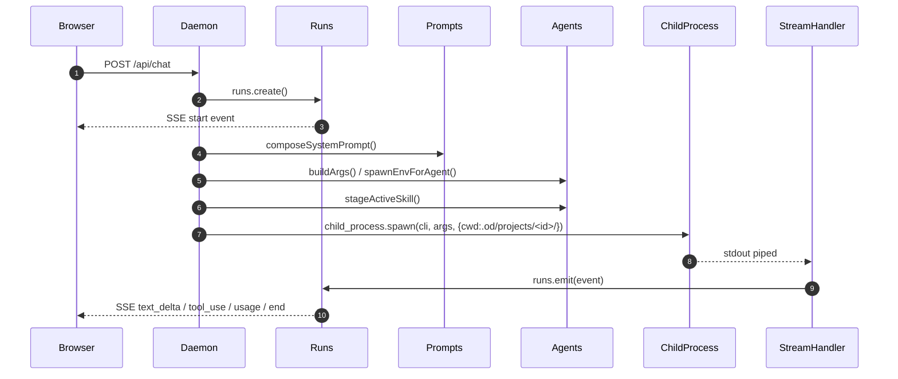

### Entry Point

`POST /api/chat` in `apps/daemon/src/server.ts`

### Main Files

- `apps/daemon/src/server.ts` — route handler and `startChatRun()`
- `apps/daemon/src/runs.ts` — `createChatRunService()`: run lifecycle
- `apps/daemon/src/prompts/system.ts` — `composeSystemPrompt()`
- `apps/daemon/src/agents.ts` — `buildArgs()`, `spawnEnvForAgent()`, `resolveAgentBin()`
- `apps/daemon/src/skills.ts` — `listSkills()`, `findSkillById()`
- `apps/daemon/src/design-systems.ts` — `readDesignSystem()`
- `apps/daemon/src/craft.ts` — `loadCraftSections()`
- `apps/daemon/src/cwd-aliases.ts` — `stageActiveSkill()`

### Data Structures

```typescript
// Request body for POST /api/chat
{
  projectId: string;
  conversationId: string;
  assistantMessageId: string;
  agentId: string;      // e.g. 'claude-code', 'codex'
  model?: string;
  prompt: string;
  // ... image paths, extra allowed dirs, metadata
}

// Run record (in-memory)
{
  id: string;           // UUID
  projectId: string | null;
  conversationId: string | null;
  agentId: string | null;
  status: 'queued' | 'running' | 'succeeded' | 'failed' | 'canceled';
  events: Array<{ id, event, data }>;
  child: ChildProcess | null;
  acpSession: AcpSession | null;
}
```

### Step-by-Step

1. Client sends `POST /api/chat` with prompt, projectId, agentId, model, and optional image paths.
2. `design.runs.create()` allocates a new run record with `status: 'queued'` and a UUID.
3. `design.runs.stream(run, req, res)` opens the SSE response. The client immediately starts receiving `event: start`.
4. `design.runs.start(run, () => startChatRun(body, run))` launches the async starter function.
5. Inside `startChatRun()`:
   a. Load the project from SQLite to get `skill_id`, `design_system_id`, and metadata.
   b. Call `listSkills(skillsRoot)` and `findSkillById(skills, skill_id)` to get the skill object.
   c. Call `readDesignSystem(dsRoot, design_system_id)` to get the DESIGN.md body.
   d. Call `loadCraftSections(craftDir, skill.craftRequires)` to get craft body + sections.
   e. Call `stageActiveSkill(cwd, folderName, sourceDir)` to copy the skill folder into `.od-skills/`.
   f. Call `composeSystemPrompt({ agentId, skillBody, skillName, skillMode, designSystemBody, craftBody, ... })` to build the system prompt string.
   g. Call `resolveAgentBin(agentId)` to get the CLI binary path.
   h. Call `buildArgs(prompt, imagePaths, extraAllowedDirs, options, runtimeContext)` on the agent definition to produce the argv array.
   i. Call `spawnEnvForAgent(agentId, baseEnv)` to build the child process environment.
   j. Call `spawn(bin, args, { cwd: projectDir, env })` via `node:child_process`.
6. The child process's stdout/stderr are piped. The appropriate stream handler (`createClaudeStreamHandler`, `createQoderStreamHandler`, `attachAcpSession`) is attached based on `streamFormat`.
7. Events from the stream handler are emitted onto the run via `design.runs.emit(run, event, data)`, which SSE-pushes them to all connected clients.
8. When the child exits, `design.runs.finish(run, 'succeeded' | 'failed', exitCode)` is called.

### Side Effects

- A new run record is created in-memory (TTL: 30 minutes).
- The active skill is copied to `<projectCwd>/.od-skills/<folderName>/`.
- A child process is spawned under `<projectCwd>` with the composed environment.
- SQLite may be updated when the daemon fetches or updates project metadata.

### Outputs

- SSE stream of events: `start`, `status`, `text_delta`, `thinking_delta`, `tool_use`, `tool_result`, `usage`, `end`.
- Child process stdout is the primary data source for events.

### Failure Modes

- `OD_BIN` not set or binary not found → `ENOENT` on spawn → `error` SSE event → run `status: 'failed'`.
- `composeSystemPrompt()` throws → caught by `runs.start()`'s `.catch()` → `fail(run, 'AGENT_EXECUTION_FAILED', message)`.
- Project not found in SQLite → daemon returns 400/404 before creating the run.
- Port conflict on daemon startup → entire daemon fails to start; `POST /api/chat` never reaches the handler.

### Debugging Tips

- `pnpm tools-dev logs --json` — daemon stdout, includes `[spawn]` and `[chat]` prefixed lines.
- Check `pnpm tools-dev status --json` to confirm daemon is running.
- Add `console.log` in `buildArgs()` in `agents.ts` to inspect the exact argv array.
- Inspect `<OD_DATA_DIR>/projects/<id>/` — this is the agent's CWD.

### Evidence (file paths)

- `apps/daemon/src/server.ts` lines 5129–5133 (route handler)
- `apps/daemon/src/runs.ts` (`createChatRunService`, `create`, `start`, `emit`, `finish`)
- `apps/daemon/src/agents.ts` (`buildArgs`, `spawnEnvForAgent`, `resolveAgentBin`)

---

## Flow 2: Skill Selection & Loading

### Summary

The web UI fetches all available skills, displays them in a grouped picker, and stores the selected skill ID on the project. On the next chat turn, the daemon resolves the skill body and stages its side files.

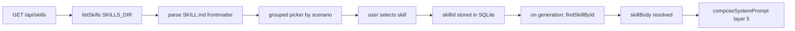

### Entry Point

`GET /api/skills` in `apps/daemon/src/server.ts`

### Main Files

- `apps/daemon/src/skills.ts` — `listSkills()`, `findSkillById()`, `SKILL_ID_ALIASES`, `withSkillRootPreamble()`
- `apps/daemon/src/server.ts` — route handler
- `apps/daemon/src/frontmatter.ts` — `parseFrontmatter()`
- `apps/daemon/src/cwd-aliases.ts` — `stageActiveSkill()`
- `skills/*/SKILL.md` — skill definitions

### Data Structures

```typescript
// Skill object returned by listSkills()
{
  id: string;
  name: string;
  description: string;
  triggers: string[];
  mode: 'prototype' | 'deck' | 'template' | 'design-system' | 'image' | 'video' | 'audio';
  surface: string;
  craftRequires: string[];
  platform: 'web' | 'mobile' | 'desktop';
  scenario: 'operations' | 'design' | 'engineering';
  previewType: 'html' | 'jsx' | 'pptx' | 'markdown';
  designSystemRequired: boolean;
  defaultFor: string | string[] | null;
  upstream: string | null;
  featured: boolean | string[];
  fidelity: string | null;
  speakerNotes: boolean | null;
  animations: boolean | null;
  examplePrompt: string;
  body: string;  // SKILL.md body (non-frontmatter), optionally prefixed with preamble
  dir: string;   // absolute path to skill folder
}
```

### Step-by-Step

1. Client calls `GET /api/skills`.
2. Daemon calls `listSkills(skillsRoot)` for each discovery root. For each root, it reads all subdirectories and looks for `SKILL.md`.
3. For each found `SKILL.md`, `parseFrontmatter()` splits YAML frontmatter from body. Fields are normalized (mode, platform, scenario, craft requires).
4. `dirHasAttachments(dir)` checks if the skill folder has any non-SKILL.md content. If yes, `withSkillRootPreamble(body, dir)` prepends path guidance to the body.
5. The assembled skill objects are returned. Any deprecated `name` values are left as-is in the listing (resolution happens at lookup time).
6. The web UI renders a picker. Skills are grouped by `scenario` (operations / design / engineering) and `mode`. Featured skills appear first.
7. The user selects a skill. The web stores `skillId` on the project via `PUT /api/projects/:id` (updating the SQLite row).
8. On the next `POST /api/chat`, `findSkillById(skills, skillId)` is called. It applies `resolveSkillId()` first (alias resolution), then finds the matching skill. The resolved skill's `body` is passed to `composeSystemPrompt()`.

### Side Effects

- `stageActiveSkill()` is called once per chat turn for the active skill, copying the skill folder to `.od-skills/<folderName>/` inside the project CWD.

### Outputs

- HTTP JSON array of skill objects (without `dir`, without full `body` for picker — [Uncertain: whether `body` is omitted from the listing endpoint or included]).
- At chat time: `skillBody` string injected into the system prompt.

### Failure Modes

- Unreadable `SKILL.md` — silently skipped by `listSkills()`.
- Invalid frontmatter YAML — `parseFrontmatter()` returns empty `data`; skill uses fallback values.
- Renamed skill without alias entry — `findSkillById()` returns `undefined`; `composeSystemPrompt()` receives no `skillBody`; output quality degrades silently.
- Skill staging failure — logged as a warning; `withSkillRootPreamble()` has already embedded the absolute fallback path, so the agent continues.

### Debugging Tips

- Check `GET /api/skills` response in browser devtools to confirm skill IDs.
- If a skill body is missing from the prompt, verify `SKILL_ID_ALIASES` contains any recent renames.
- Check `.od-skills/` in the project CWD to confirm staging ran.

### Evidence (file paths)

- `apps/daemon/src/skills.ts` (entire file)
- `apps/daemon/src/cwd-aliases.ts` (`stageActiveSkill`)

---

## Flow 3: Design System Selection & Injection

### Summary

The web UI fetches all design systems with swatch data, the user picks one in a dropdown, and the selection is stored on the project. At chat time, the full DESIGN.md body is fetched and injected into the system prompt as authoritative brand tokens.

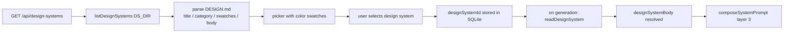

### Entry Point

`GET /api/design-systems` in `apps/daemon/src/server.ts`

### Main Files

- `apps/daemon/src/design-systems.ts` — `listDesignSystems()`, `readDesignSystem()`
- `apps/daemon/src/server.ts` — route handlers
- `design-systems/*/DESIGN.md` — design system definitions

### Data Structures

```typescript
// Design system listing item
{
  id: string;       // folder name
  title: string;    // H1, boilerplate-stripped
  category: string; // from "> Category: <name>" blockquote
  summary: string;  // first paragraph after H1 (max 240 chars)
  swatches: string[]; // up to 4 hex strings [bg, support, fg, accent]
  surface: 'web' | 'image' | 'video' | 'audio';
  body: string;     // full DESIGN.md content
}
```

### Step-by-Step

1. Client calls `GET /api/design-systems`.
2. Daemon calls `listDesignSystems(DESIGN_SYSTEMS_DIR)`. For each subdirectory, it reads `DESIGN.md`.
3. `cleanTitle()` strips the `"Design System (Inspired by|for)"` prefix from the H1.
4. `extractCategory()` parses the `> Category: <name>` blockquote.
5. `summarize()` extracts the first paragraph after the H1 (up to 240 characters), stripping the Category line.
6. `extractSwatches()` runs a greedy regex scan for `name: #HEXVAL` patterns and selects up to 4 representative colors (background, support tone, foreground, accent), deduped by name+value.
7. `extractSurface()` reads the `> Surface: <value>` blockquote if present; defaults to `'web'`.
8. The listing is returned. The web UI renders a grouped picker with swatch strips and category labels.
9. The user selects a design system. The web stores `designSystemId` on the project.
10. At chat time, `readDesignSystem(dsRoot, designSystemId)` fetches the full `DESIGN.md` body (re-reads from disk each turn — no caching).
11. `composeSystemPrompt()` receives the full body as `designSystemBody` and `title` as `designSystemTitle`. It injects:
    ```
    ## Active design system — <title>

    Treat the following DESIGN.md as authoritative for color, typography, spacing,
    and component rules. Do not invent tokens outside this palette. When you copy
    the active skill's seed template, bind these tokens into its `:root` block
    before generating any layout.

    <full DESIGN.md content>
    ```

### Side Effects

None beyond the disk read. The design system listing is re-scanned on every `GET /api/design-systems` call — no watching.

### Outputs

- HTTP JSON array of design system listing items.
- At chat time: `designSystemBody` string (the full DESIGN.md) injected as layer 3 of the system prompt.

### Failure Modes

- `DESIGN.md` is missing or unreadable → directory silently skipped.
- `> Category: <name>` blockquote absent → category defaults to `'Uncategorized'`.
- `readDesignSystem()` returns `null` (design system ID no longer exists on disk) → `designSystemBody` is `undefined` → layer 3 is skipped; agent gets no brand tokens.
- No swatches found → `swatches: []` → picker renders without color preview.

### Debugging Tips

- Inspect `GET /api/design-systems` in devtools to confirm the design system is discovered and `swatches` is populated.
- If brand tokens are absent from the system prompt, confirm the `design_system_id` is set on the project in SQLite.

### Evidence (file paths)

- `apps/daemon/src/design-systems.ts` (entire file)
- `apps/daemon/src/prompts/system.ts` lines 151–155 (injection)

---

## Flow 4: Prompt Composition (10-Layer Stack)

### Summary

Before spawning an agent, the daemon assembles the full system prompt by layering discovery protocol, base identity, brand tokens, craft rules, skill workflow, project metadata, and optional framework overlays. The output is a single string passed as the `system` field to the agent CLI.

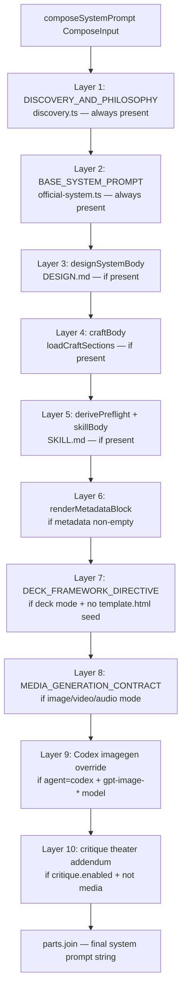

### Entry Point

`composeSystemPrompt(input: ComposeInput)` in `apps/daemon/src/prompts/system.ts`

### Main Files

- `apps/daemon/src/prompts/system.ts` — `composeSystemPrompt()`, `derivePreflight()`
- `apps/daemon/src/prompts/discovery.ts` — `DISCOVERY_AND_PHILOSOPHY`
- `apps/daemon/src/prompts/official-system.ts` — `OFFICIAL_DESIGNER_PROMPT`
- `apps/daemon/src/prompts/deck-framework.ts` — `DECK_FRAMEWORK_DIRECTIVE`
- `apps/daemon/src/prompts/media-contract.ts` — `MEDIA_GENERATION_CONTRACT`
- `apps/daemon/src/prompts/panel.ts` — `renderPanelPrompt()` (Critique Theater)
- `apps/daemon/src/craft.ts` — `loadCraftSections()`

### Data Structures

```typescript
interface ComposeInput {
  agentId?: string;
  includeCodexImagegenOverride?: boolean;
  skillBody?: string;
  skillName?: string;
  skillMode?: 'prototype' | 'deck' | 'template' | 'design-system' | 'image' | 'video' | 'audio';
  designSystemBody?: string;
  designSystemTitle?: string;
  craftBody?: string;
  craftSections?: string[];
  metadata?: ProjectMetadata;
  template?: ProjectTemplate;
  critique?: CritiqueConfig;
  critiqueBrand?: { name: string; design_md: string };
  critiqueSkill?: { id: string };
}
```

### Step-by-Step

1. Start with `parts: string[] = []`.
2. **Layer 1 — Discovery:** Push `DISCOVERY_AND_PHILOSOPHY`. Hard-codes turn-1 form syntax, direction-picker, brand-spec extraction, TodoWrite reinforcement, 5-dim critique protocol. Always present.
3. **Layer 2 — Base System:** Push separator + `OFFICIAL_DESIGNER_PROMPT` (identity, workflow, content-philosophy charter). Always present.
4. **Layer 3 — Design System:** If `designSystemBody` is non-empty, push `## Active design system — <title>` + authoritative preamble + body. Brand DESIGN.md wins on token values for all layers below.
5. **Layer 4 — Craft:** If `craftBody` is non-empty, push `## Active craft references — <slugs>` + resolution conflict rule + body. Craft governs anything the brand DESIGN.md doesn't override.
6. **Layer 5 — Skill + Preflight:** If `skillBody` is non-empty:
   - Call `derivePreflight(skillBody)` — if the body references `assets/template.html` or known `references/*.md` patterns, returns a hard pre-flight directive string.
   - Push `## Active skill — <name>` + preflight directive + body.
7. **Layer 6 — Metadata Block:** `renderMetadataBlock(metadata, template)` builds a block describing project intent, fidelity, speaker notes, animation intent, and template file snapshots. Pushed if non-empty.
8. **Layer 7 — Deck Framework:** If `skillMode === 'deck'` OR `metadata.kind === 'deck'`, AND the skill body does NOT reference `assets/template.html` (i.e., no skill seed), push `DECK_FRAMEWORK_DIRECTIVE`. This is the load-bearing nav/counter/scroll JS/print stylesheet contract for PDF stitching. Pinned last so it overrides softer wording.
9. **Layer 8 — Media Contract:** If mode is `image`, `video`, or `audio`, push `MEDIA_GENERATION_CONTRACT`. Governs how the agent calls `od media generate`.
10. **Layer 9 — Codex Imagegen Override:** If `agentId === 'codex'` AND `metadata.kind === 'image'` AND image model is a GPT-image model, push `renderCodexImagegenOverride()`. Instructs the agent to use Codex built-in imagegen instead of the `od media generate` CLI.
11. **Layer 10 — Critique Addendum:** If critique is enabled (`cfg.enabled === true`) AND `critiqueBrand` and `critiqueSkill` are provided AND the surface is not media, push `renderPanelPrompt()`. Critique Theater protocol is pinned last.
12. Return `parts.join('')`.

### Side Effects

None. `composeSystemPrompt()` is a pure function.

### Outputs

A single string — the composed system prompt — typically ranging from a few thousand to tens of thousands of characters depending on which layers are active.

### Failure Modes

- If `skillBody` or `designSystemBody` are empty strings, the relevant layers are silently skipped — no error, but output quality degrades.
- If `derivePreflight()` detects a seed reference but the file was not staged, the agent receives the directive but cannot find the file. It falls back to the absolute path in the preamble.
- Critique Theater is silently skipped on media surfaces — this is intentional, not a bug.

### Debugging Tips

- Log the return value of `composeSystemPrompt()` to see the exact prompt string before it is passed to the agent.
- Search for `## Active design system` / `## Active skill` in the composed prompt to confirm layers were injected.

### Evidence (file paths)

- `apps/daemon/src/prompts/system.ts` lines 125–237 (`composeSystemPrompt` function body)
- `apps/daemon/src/prompts/system.ts` lines 523–532 (`derivePreflight`)

---

## Flow 5: Agent Execution (claude-stream-json path)

### Summary

For Claude Code and similar agents that emit JSONL on stdout, the daemon uses `createClaudeStreamHandler()` to parse line-delimited JSON into typed UI events, which are SSE-pushed to the web client.

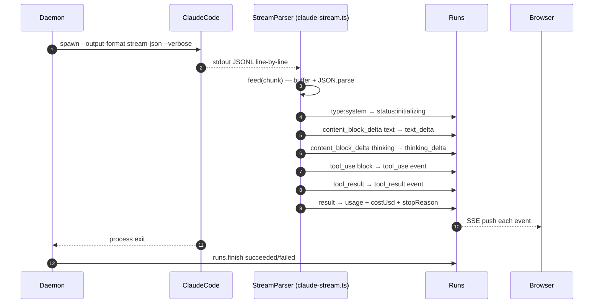

### Entry Point

`createClaudeStreamHandler(onEvent)` in `apps/daemon/src/claude-stream.ts`

### Main Files

- `apps/daemon/src/claude-stream.ts` — `createClaudeStreamHandler()`
- `apps/daemon/src/runs.ts` — `emit(run, event, data)` — SSE dispatch
- `apps/daemon/src/server.ts` — attaches handler to child process stdout

### Data Structures

```typescript
// Typed events emitted by createClaudeStreamHandler
type AgentEvent =
  | { type: 'status'; status: string }
  | { type: 'text_delta'; delta: string }
  | { type: 'thinking_delta'; delta: string }
  | { type: 'tool_use'; id: string; name: string; input: unknown }
  | { type: 'tool_result'; tool_use_id: string; content: string; is_error: boolean }
  | { type: 'usage'; input_tokens: number; output_tokens: number; cache_read: number; cache_write: number; cost_usd: number }
  | { type: 'raw'; line: string }
```

### Step-by-Step

1. The agent process is spawned with `--output-format stream-json --verbose` (and optionally `--include-partial-messages` if the CLI supports it — capability-flagged).
2. `child.stdout` is piped. Each chunk is fed to `handler.feed(chunk)`.
3. Inside `feed()`, the buffer accumulates chunks. When a newline is found, the line is extracted and `JSON.parse()`d.
4. `handleObject(obj)` dispatches on `obj.type`:
   - `type: 'system'` → emits `{ type: 'status', status: obj.subtype }`.
   - `type: 'assistant'` with content blocks → scans blocks for `type: 'text'` and emits `text_delta`. Skips messages that already streamed via `stream_event` (tracked in `textStreamed` set).
   - `type: 'stream_event'` (partial message mode) → dispatches on sub-event type: `content_block_delta` → accumulates text/thinking, emits `text_delta` / `thinking_delta`. `input_json_delta` accumulates tool input. `content_block_stop` → finalizes tool input, emits `tool_use`.
   - `type: 'tool_result'` → emits `tool_result`.
   - `type: 'result'` with usage → emits `usage` event with token counts and cost.
   - Unrecognized types → emits `{ type: 'raw', line }`.
5. Each `onEvent` call triggers `design.runs.emit(run, event.type, event)`, SSE-pushing the event to all connected web clients.
6. `text_delta` events are received by the web UI and fed to `ArtifactParser.feed(delta)`.
7. When the process exits, `finish(run, ...)` is called.

### Side Effects

- Per-content-block state is tracked in `blocks: Map<string, BlockState>` to accumulate partial tool input JSON.
- The `textStreamed` set grows with each assistant message ID that has streamed deltas.

### Outputs

A sequence of typed SSE events delivered to the web client. The primary data for artifact rendering is `text_delta` events.

### Failure Modes

- Malformed JSON line → `{ type: 'raw', line }` event — the line is forwarded but not parsed. If the agent emits corrupt JSONL intermittently, some events may be lost.
- `--include-partial-messages` not supported by older Claude Code version → text arrives only in the final `assistant` wrapper, not as streaming deltas. The handler handles this via the `textStreamed` deduplication set, but the UI will not show incremental text.
- Process exits non-zero → `finish(run, 'failed', exitCode)`.

### Debugging Tips

- Pipe `child.stdout` to a file to capture raw JSONL for offline inspection.
- Add a `console.log` in `feed()` or `handleObject()` to trace event dispatch.
- Check `type: 'raw'` events in the SSE stream — they indicate unparseable lines.

### Evidence (file paths)

- `apps/daemon/src/claude-stream.ts` (entire file, especially `feed()` and `handleObject()`)

---

## Flow 6: Agent Execution (acp-json-rpc path)

### Summary

For agents using the ACP (Agent Communication Protocol) JSON-RPC over stdio — such as Kimi or Hermes — the daemon drives an `initialize → session/new → session/set_model → session/prompt` lifecycle and maps response events into the same typed UI event format.

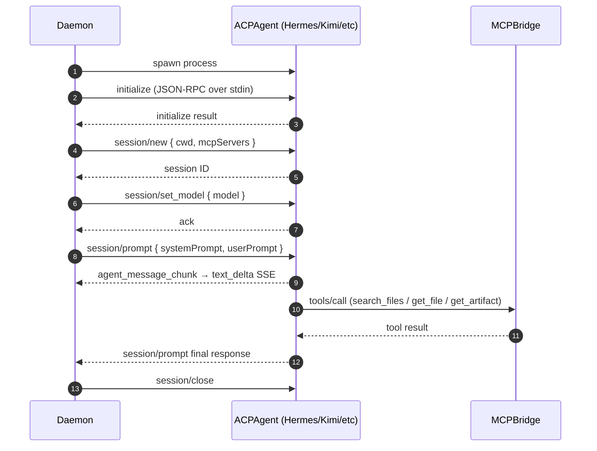

### Entry Point

`attachAcpSession(child, run, emit, ...)` in `apps/daemon/src/acp.ts`

### Main Files

- `apps/daemon/src/acp.ts` — `attachAcpSession()`, `buildAcpSessionNewParams()`, `sendRpc()`
- `apps/daemon/src/runs.ts` — `emit()` — SSE dispatch

### Data Structures

```typescript
// ACP JSON-RPC wire format
{ "jsonrpc": "2.0", "id": <number|string>, "method": "<method>", "params": { ... } }
{ "jsonrpc": "2.0", "id": <number|string>, "result": { ... } }
{ "jsonrpc": "2.0", "id": <number|string>, "error": { "code": <number>, "message": <string> } }

// ACP protocol version
const ACP_PROTOCOL_VERSION = 1;
```

### Step-by-Step

1. Agent process is spawned. `attachAcpSession(child, ...)` is called.
2. `sendRpc(child.stdin, id, 'initialize', { protocolVersion: ACP_PROTOCOL_VERSION })` — handshake.
3. Wait for RPC response. On success, send `session/new` with `{ cwd, mcpServers }` from `buildAcpSessionNewParams()`.
4. On `session/new` response, send `session/set_model` with the resolved model name.
5. On `session/set_model` response, send `session/prompt` with `{ systemPrompt, userPrompt }`.
6. Parse stdout line-by-line for JSON-RPC responses and notifications. Map update notifications to typed events:
   - Text content → `text_delta`
   - Tool calls → `tool_use`
   - Tool results → `tool_result`
   - Usage/cost → `usage`
   - Error → SSE `error` event
7. On `session/prompt` final response, call `finish(run, 'succeeded')`.

### Side Effects

- Writes JSON-RPC requests to `child.stdin`. Reads responses from `child.stdout`.
- A session state object tracks the current request ID counter.

### Outputs

Same typed SSE events as the claude-stream-json path (`text_delta`, `tool_use`, `tool_result`, `usage`, `end`).

### Failure Modes

- Initialize handshake times out (default `DEFAULT_TIMEOUT_MS = 15_000` ms) → session aborted, run failed.
- Stage timeout (default `DEFAULT_STAGE_TIMEOUT_MS = 180_000` ms) waiting for `session/prompt` completion → run failed.
- JSON-RPC error response → `rpcErrorMessage()` extracts message → SSE error event.
- Agent process exits before completing the session → `finish(run, 'failed', exitCode)`.

### Debugging Tips

- Add logging to `sendRpc()` and the response handler to trace the RPC lifecycle.
- Check for `json-rpc error` in SSE error events — these come from `rpcErrorMessage()`.

### Evidence (file paths)

- `apps/daemon/src/acp.ts` (entire file)

---

## Flow 7: Artifact Generation & Pre-flight

### Summary

Before the agent writes any code, it is directed to read seed and reference files (pre-flight). The agent then writes an HTML file to its project CWD, emits it wrapped in `<artifact>` tags, and the daemon (and optionally the linter) processes the output.

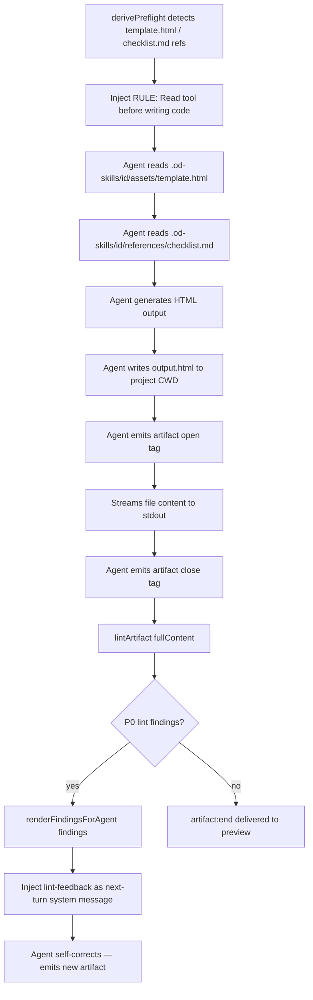

### Entry Point

System prompt `derivePreflight()` directive → agent file reads → `<artifact>` tag emission

### Main Files

- `apps/daemon/src/prompts/system.ts` — `derivePreflight()`
- `apps/daemon/src/skills.ts` — `withSkillRootPreamble()`
- `apps/daemon/src/cwd-aliases.ts` — `stageActiveSkill()`
- `apps/daemon/src/lint-artifact.ts` — `lintArtifact()`, `renderFindingsForAgent()`
- `apps/web/src/artifacts/parser.ts` — `ArtifactParser`
- `skills/web-prototype/assets/template.html` — seed file (example)
- `skills/web-prototype/references/layouts.md` — reference file (example)

### Data Structures

```
// Agent output format (embedded in text_delta stream)
<artifact identifier="kebab-case-slug" type="text/html" title="Human Title">
<!doctype html>
<html>...</html>
</artifact>
```

### Step-by-Step

1. The composed system prompt contains the `derivePreflight()` directive (if the skill has side files): "Pre-flight: Read `assets/template.html`, `references/layouts.md`, `references/checklist.md` BEFORE any other tool."
2. The skill root preamble (prepended by `withSkillRootPreamble()`) tells the agent to find these files at `.od-skills/<folder>/` (CWD-relative, primary) or the absolute path (fallback).
3. The agent uses its file-read tool to read the seed and reference files.
4. The agent writes `index.html` (or the skill-specified entry file) to the project CWD.
5. The agent emits the `<artifact>` opening tag, streams the file content, then emits `</artifact>`.
6. Each `text_delta` from the agent is fed to the web's `ArtifactParser.feed(delta)`.
7. **[Partially Verified]** When the artifact is complete (on `artifact:end`), the daemon may call `lintArtifact(fullContent)` to check for P0 anti-slop violations.
8. If P0 findings exist, `renderFindingsForAgent(findings)` produces a formatted message that is injected back into the conversation as a system message on the next turn, prompting the agent to self-correct.

### Side Effects

- The HTML file is written to `<OD_DATA_DIR>/projects/<id>/index.html` (or the agent's designated output path).
- Lint findings may trigger an additional agent turn.

### Outputs

- `ArtifactEvent { type: 'artifact:end', identifier, fullContent }` — the complete HTML string.
- The web UI assigns `fullContent` to the preview iframe `srcdoc`.
- Lint findings are stored and exposed via `GET /api/artifacts/lint`.

### Failure Modes

- Agent skips pre-flight (ignores directive) → output may regress to AI-slop tropes → P0 lint findings on next turn.
- Seed file not found at either path → agent writes CSS from scratch → typically lower quality output.
- `<artifact>` tag is malformed (missing `identifier` or `type`) → parser emits no `artifact:start` → preview is blank.
- Lint findings feed back into an infinite correction loop — the critique loop has `OD_CRITIQUE_MAX_ROUNDS` as a safety ceiling.

### Debugging Tips

- Check `.od-skills/` in the project CWD for the staged skill files.
- Look for `artifact:start` / `artifact:end` events in the SSE stream.
- Call `POST /api/artifacts/lint` with the HTML body to run lint checks manually.

### Evidence (file paths)

- `apps/daemon/src/prompts/system.ts` lines 523–532 (`derivePreflight`)
- `apps/daemon/src/lint-artifact.ts` (P0 check list and `renderFindingsForAgent`)
- `apps/daemon/src/cwd-aliases.ts` (`stageActiveSkill`)

---

## Flow 8: Preview Rendering (srcdoc iframe)

### Summary

The web UI's artifact preview pane uses a streaming `<artifact>` tag parser to incrementally update an iframe's `srcdoc` attribute as text deltas arrive from the SSE stream.

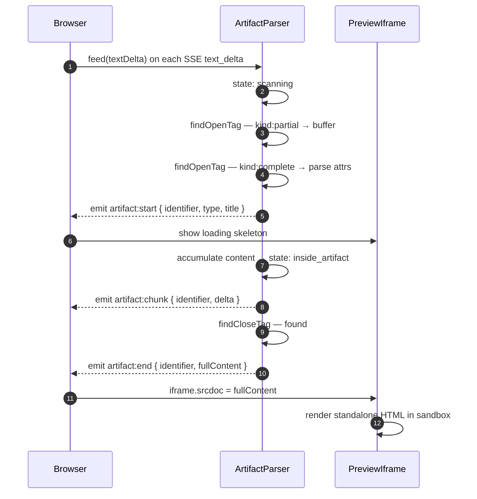

### Entry Point

`ArtifactParser.feed(delta: string)` in `apps/web/src/artifacts/parser.ts`

### Main Files

- `apps/web/src/artifacts/parser.ts` — `ArtifactParser`, `ArtifactEvent` types
- Web UI preview component — consumes `ArtifactEvent` stream, updates iframe

### Data Structures

```typescript
type ArtifactEvent =
  | { type: 'text'; delta: string }
  | { type: 'artifact:start'; identifier: string; artifactType: string; title: string }
  | { type: 'artifact:chunk'; identifier: string; delta: string }
  | { type: 'artifact:end'; identifier: string; fullContent: string };

interface ParserState {
  inside: boolean;   // currently inside an <artifact> tag
  buffer: string;    // partial input not yet parsed
  identifier: string;
  artifactType: string;
  title: string;
  content: string;   // accumulated artifact content
}
```

### Step-by-Step

1. The web component subscribes to `text_delta` SSE events.
2. Each `delta` string is passed to `parser.feed(delta)`. The parser appends to its internal `buffer`.
3. `findOpenTag(buffer)` scans for `<artifact ` prefix:
   - `kind: 'partial'` → waits for more input.
   - `kind: 'complete'` → parses `identifier`, `type`, `title` attributes via `parseAttrs()`.
4. On `artifact:start`: the web component stores the `identifier` and prepares the preview area. The iframe may show a loading skeleton.
5. Each subsequent delta that is inside the artifact block is accumulated in `state.content` and emitted as `artifact:chunk`. The web component can optionally update `srcdoc` progressively (streaming preview) or wait for completion.
6. `findCloseTag(buffer)` scans for `</artifact>`. When found, `state.content` contains the full artifact.
7. `artifact:end` is emitted with `{ identifier, fullContent }`. The web component assigns `fullContent` to `iframe.srcdoc`. The browser parses and renders the HTML in a sandboxed context.
8. Subsequent artifact emissions (if the agent produces multiple artifacts in one turn) are handled independently.

### Side Effects

None in the parser itself. The web component updates DOM.

### Outputs

- `iframe.srcdoc` = the complete HTML content of the artifact.
- The preview pane renders the artifact in a sandboxed iframe.

### Failure Modes

- `<artifact>` tag never arrives in the SSE stream → preview stays blank. Check the agent's raw output.
- Tag is partially received and stream ends before `</artifact>` → `artifact:end` never fires → `fullContent` is never assigned → preview stays blank.
- HTML contains syntax errors → browser renders what it can; devtools shows parse warnings in the frame.
- CSP / sandbox attribute on the iframe blocks JavaScript execution → interactive prototype features break. Check the preview iframe's sandbox attribute in the web component.

### Debugging Tips

- In browser devtools, inspect the `srcdoc` attribute of the preview iframe element.
- Log `ArtifactEvent` payloads to trace parser state.
- If `artifact:end` never fires, the SSE stream may have ended prematurely — check the run's final status.

### Evidence (file paths)

- `apps/web/src/artifacts/parser.ts` (entire file)

---

## Flow 9: Export (HTML / PDF / PPTX / ZIP) [Partially Verified]

### Summary

The user triggers an export from the web UI. Depending on format, the daemon either bundles files (ZIP), serves inline HTML, triggers a browser print dialog (PDF), or relies on the agent having already produced the output file (PPTX).

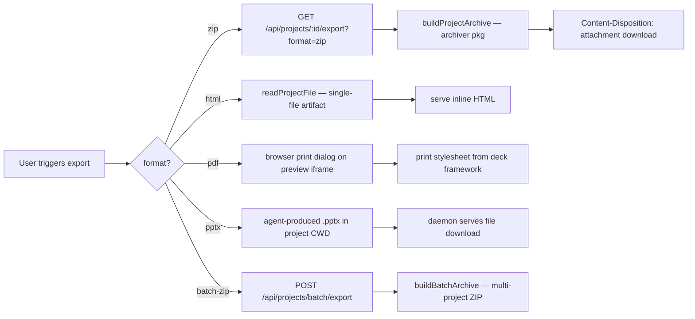

### Entry Point

`GET /api/projects/:id/export` or `POST /api/projects/batch/export` in `apps/daemon/src/server.ts`

### Main Files

- `apps/daemon/src/projects.ts` — `buildProjectArchive()`, `buildBatchArchive()`, `readProjectFile()`, `listFiles()`
- `apps/daemon/src/server.ts` — export route handlers

### Data Structures

```typescript
// Archive result from buildProjectArchive()
{ buffer: Buffer; baseName: string }

// Archive result from buildBatchArchive()
{ buffer: Buffer }
```

### Step-by-Step

**ZIP Export:**
1. Client calls `GET /api/projects/:id/export?format=zip`.
2. Daemon calls `buildProjectArchive(projectDir, projectId)` which uses the `archiver` package to zip the project directory contents.
3. The archive buffer is returned as a file download with a `Content-Disposition: attachment` header.

**HTML Export:**
1. Client calls the HTML export endpoint.
2. Daemon reads the primary HTML file via `readProjectFile()` and serves it inline. Assets are expected to already be embedded (single-file artifact contract).

**PDF Export: [Partially Verified]**
1. The web UI likely triggers the browser's print dialog on the preview iframe.
2. The iframe's print stylesheet (injected by the deck framework or skill) controls the printed layout.
3. No daemon involvement at print time — the PDF is generated client-side by the browser.

**PPTX Export: [Partially Verified]**
1. The agent is prompted to produce a `.pptx` file as part of its output contract (deck skills).
2. The daemon serves the agent-produced file from the project CWD via a file download endpoint.

**Batch ZIP Export:**
1. Client calls `POST /api/projects/batch/export` with an array of project IDs.
2. `buildBatchArchive()` creates a single ZIP containing subdirectories for each project.

### Side Effects

- No writes. Archive creation is read-only.

### Outputs

- Binary file download (`application/zip`, `text/html`, `application/vnd.openxmlformats-officedocument.presentationml.presentation`).

### Failure Modes

- Project directory not found → 404.
- Archive creation fails (disk I/O error) → 500.
- PPTX file not produced by agent → export endpoint returns empty or errors.

### Debugging Tips

- Verify the project CWD contains the expected files: `ls <OD_DATA_DIR>/projects/<id>/`.
- For PPTX issues, check whether the agent actually wrote a `.pptx` file.

### Evidence (file paths)

- `apps/daemon/src/projects.ts` (`buildProjectArchive`, `buildBatchArchive`)
- `apps/daemon/src/server.ts` lines ~3415, ~3457 (export route handlers)

---

## Flow 10: BYOK Proxy (no CLI path)

### Summary

Users who provide their own API keys can call Anthropic, OpenAI, Azure, or Google APIs through the daemon's proxy endpoints. The proxy validates the target URL (SSRF protection), forwards the request, and normalizes the response into SSE.

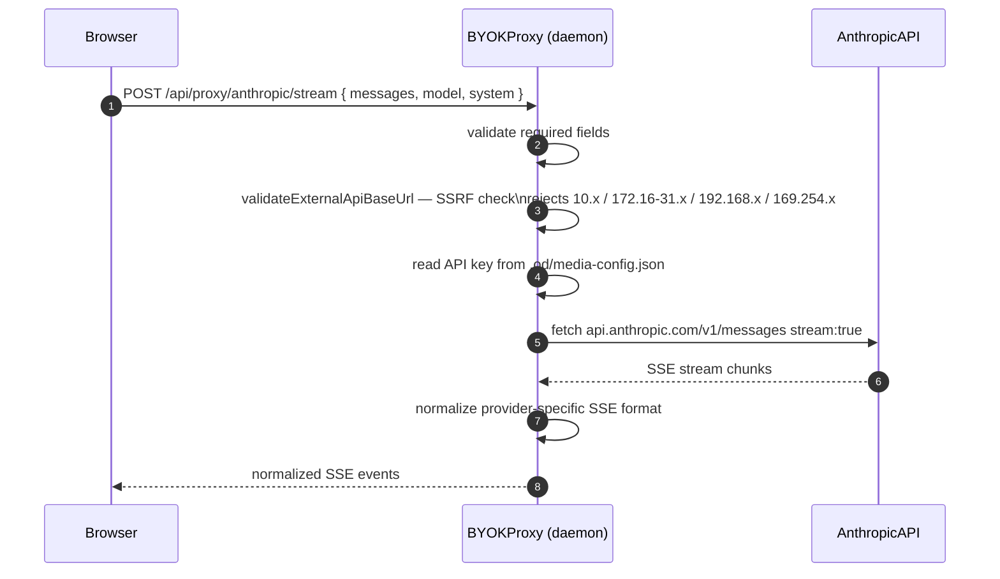

### Entry Point

`POST /api/proxy/{anthropic,openai,azure,google}/stream` in `apps/daemon/src/server.ts`

### Main Files

- `apps/daemon/src/server.ts` — proxy route handlers, `validateExternalApiBaseUrl()`

### Data Structures

```typescript
// Request body for all proxy endpoints
{
  baseUrl: string;     // e.g. 'https://api.anthropic.com'
  apiKey: string;      // user-provided
  model: string;
  systemPrompt?: string;
  messages: Array<{ role: string; content: string }>;
  maxTokens?: number;
}
```

### Step-by-Step

1. Client sends `POST /api/proxy/anthropic/stream` with `{ baseUrl, apiKey, model, messages, systemPrompt, maxTokens }`.
2. Required fields are validated. Missing `baseUrl`, `apiKey`, or `model` → 400.
3. `validateExternalApiBaseUrl(baseUrl)` checks:
   - Is it a valid URL?
   - Does it resolve to a private/loopback IP? (SSRF block) → 403.
   - Is the hostname on an allowlist of known API providers?
4. The API path is appended (`/messages` for Anthropic, `/chat/completions` for OpenAI, etc.) via `appendVersionedApiPath()`.
5. `fetch()` is called with `stream: true` and the user's `apiKey` in the appropriate header (`x-api-key` for Anthropic, `Authorization: Bearer` for OpenAI/Azure/Google).
6. The upstream SSE response is forwarded chunk-by-chunk. The daemon normalizes provider-specific SSE formats to a common event structure.
7. Errors from the upstream (non-2xx) are logged (with auth tokens redacted) and forwarded as SSE error events.

### Side Effects

- The daemon acts as a transparent proxy — no data is stored.
- The user's API key is sent to the upstream provider and never logged.

### Outputs

- SSE stream of normalized events from the upstream provider.

### Failure Modes

- SSRF attempt (private IP target) → 403 `FORBIDDEN`.
- Invalid `baseUrl` (not a URL) → 400 `BAD_REQUEST`.
- Upstream returns non-2xx → SSE error event with upstream status code.
- Network timeout fetching upstream → fetch rejects → SSE error event.

### Debugging Tips

- Check daemon logs for `[proxy:anthropic]` / `[proxy:openai]` prefixed lines.
- SSRF blocks appear as 403 responses in the browser devtools Network tab.
- To debug upstream errors, check the redacted error body in daemon logs.

### Evidence (file paths)

- `apps/daemon/src/server.ts` lines 5423–5800 (proxy route handlers for all four providers)

---

## Flow 11: Error & Anti-Slop Feedback Loop

### Summary

When an agent produces an artifact containing P0 anti-slop tropes (purple gradients, emoji feature icons, invented metrics, blue→cyan trust gradients, etc.), the linter detects them, formats a corrective message, and injects it back into the agent's context on the next turn. This creates a self-correction loop without requiring user intervention.

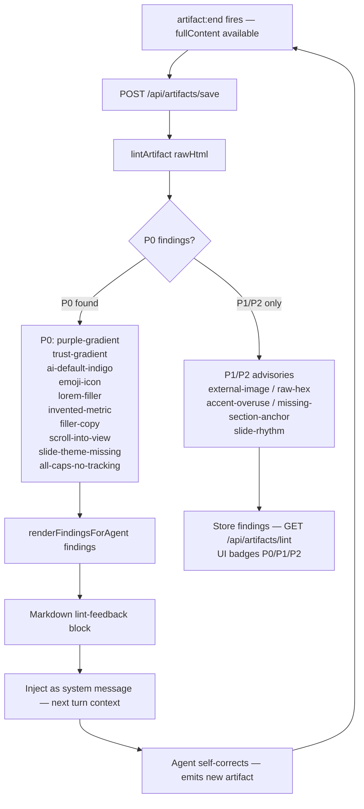

### Entry Point

`POST /api/artifacts/save` → `lintArtifact()` in `apps/daemon/src/lint-artifact.ts`

### Main Files

- `apps/daemon/src/lint-artifact.ts` — `lintArtifact()`, `renderFindingsForAgent()`
- `apps/daemon/src/server.ts` — artifact save route handler, lint route handler
- `craft/anti-ai-slop.md` — the P0 rule definitions (injected via craft system)

### Data Structures

```typescript
type LintFinding = {
  severity: 'P0' | 'P1' | 'P2';
  id: string;           // stable slug, e.g. 'purple-gradient', 'trust-gradient'
  message: string;      // one-line explanation
  fix: string;          // one-line corrective suggestion for the agent
  snippet?: string;     // matched text (≤200 chars)
};
```

### Step-by-Step

1. Agent emits `<artifact>...</artifact>`. The `artifact:end` event fires with `fullContent`.
2. **[Partially Verified]** The web UI or daemon calls `POST /api/artifacts/save` with the artifact body.
3. Inside the save handler, `lintArtifact(body)` runs a set of grep-style regex checks against the HTML:
   - **P0 `purple-gradient`**: scans for violet/indigo hex values + `linear-gradient` in proximity.
   - **P0 `trust-gradient`**: scans for blue→cyan two-stop gradient patterns.
   - **P0 `ai-default-indigo`**: scans for solid indigo fill on buttons/badges.
   - **P0 `emoji-icon`**: scans for emoji characters used as feature icons.
   - **P0 `lorem-filler`**: scans for "lorem ipsum" text.
   - **P0 `invented-metrics`**: scans for suspiciously round percentage claims.
   - P1/P2 advisories (various).
4. `renderFindingsForAgent(findings)` produces a formatted Markdown block listing P0 violations with their `id`, `message`, `fix`, and `snippet`.
5. **[Partially Verified]** This message is injected into the conversation as a system-role message on the next turn, so the agent reads it as part of its context and self-corrects.
6. The findings are also stored and accessible via `GET /api/artifacts/lint` for the web UI to render badges.

### Side Effects

- Lint findings are persisted alongside the artifact.
- A P0 finding may trigger an additional agent turn.

### Outputs

- `findings: LintFinding[]` — structured list of violations.
- Human-readable Markdown block for the agent's self-correction context.
- UI badges on saved artifacts showing P0/P1/P2 counts.

### Failure Modes

- Linter is deliberately greppy — false positives are possible (e.g., a legitimate comment about "purple gradients" triggers the rule). The `snippet` field lets the agent verify before acting.
- P0 findings injected back into context may cause the agent to over-correct (removing legitimate similar-colored elements). The `fix` field is designed to be specific enough to avoid this.
- `anti-ai-slop.md` is wired into the craft system — if `craft.requires` does not include `anti-ai-slop`, the prevention rules are absent from the prompt, and the feedback loop is the only correction mechanism.

### Debugging Tips

- Call `POST /api/artifacts/lint` with the raw HTML body to inspect findings directly.
- Check for `P0` severity findings in the lint response — these are the ones injected back to the agent.
- Verify `craft/anti-ai-slop.md` is present and the active skill includes `anti-ai-slop` in `od.craft.requires`.

### Evidence (file paths)

- `apps/daemon/src/lint-artifact.ts` (entire file — P0 check definitions starting line ~30)
- `craft/anti-ai-slop.md` (rule documentation)
