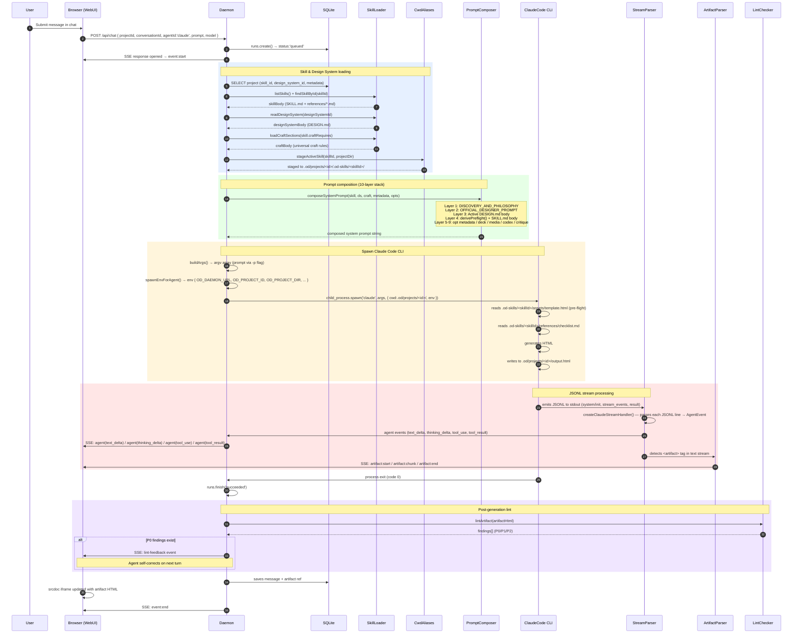
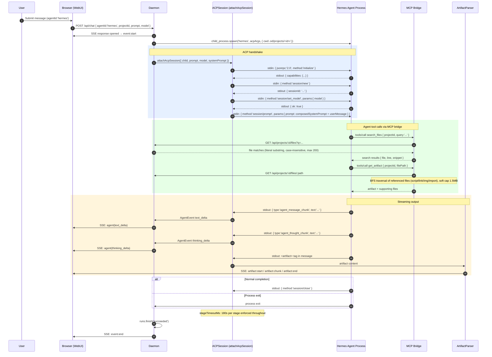
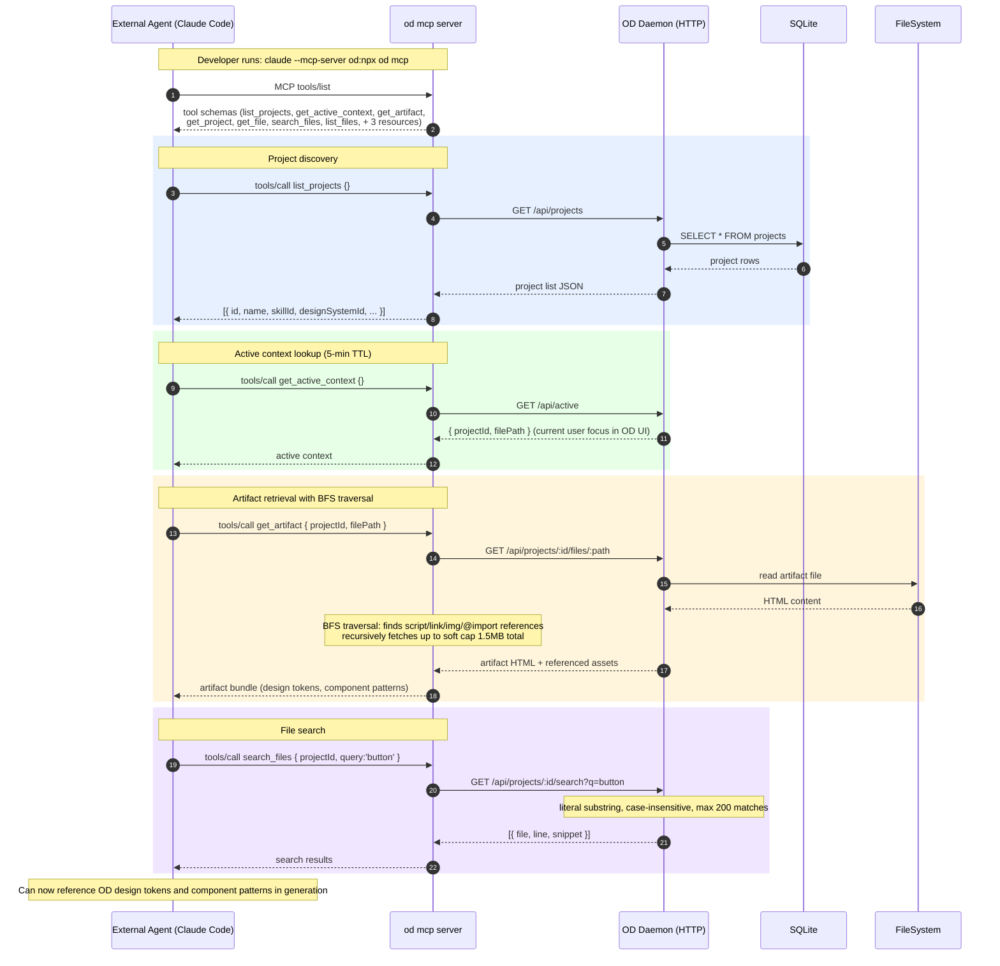
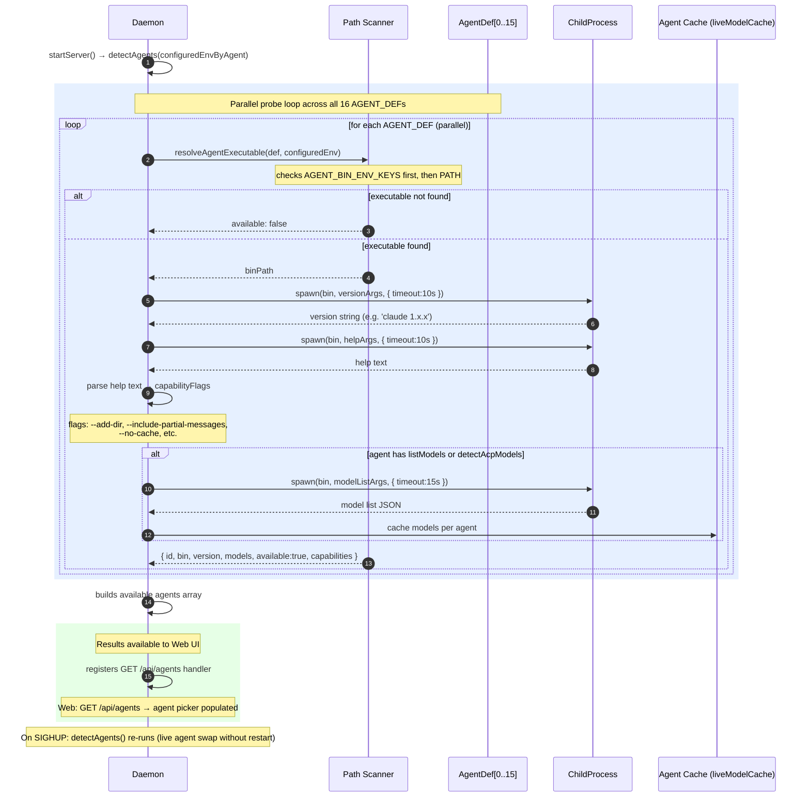
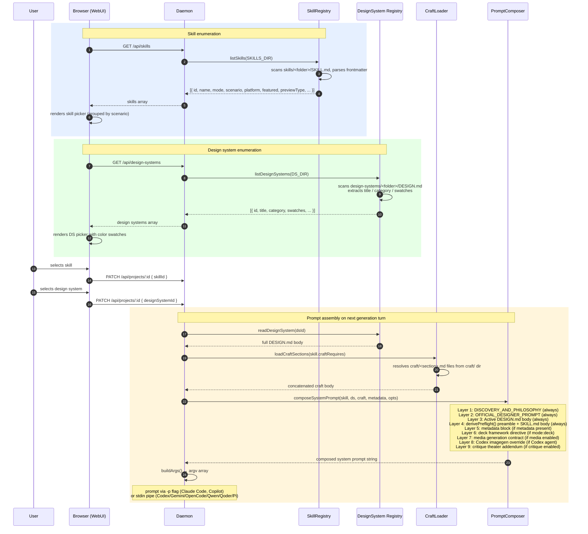
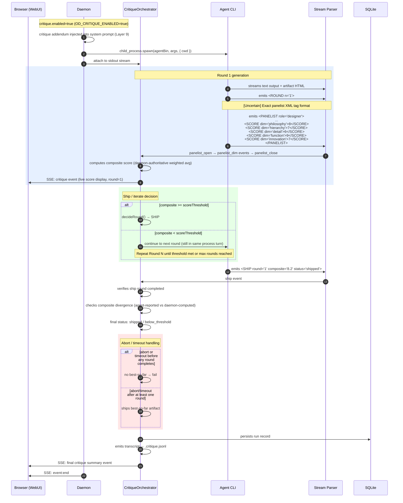
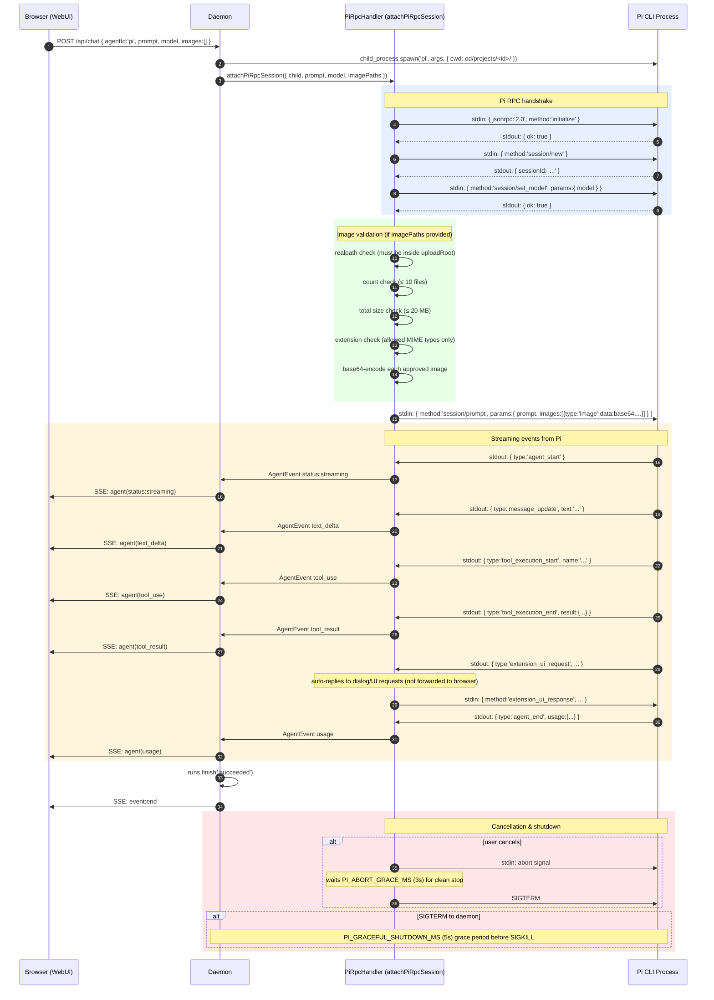

# Open Design — Sequence Diagrams

> A collection of sequence diagrams tracing the main flows, actor journeys, and protocol interactions in Open Design.
> For the full architecture overview see `open-design-architecture-overview.mmd`.
> For data flow text descriptions see `open-design-data-flow-map.md`.

## Table of Contents

1. [SD-01: Main Generation Turn (Claude Code Path)](#sd-01-main-generation-turn-claude-code-path)
2. [SD-02: Main Generation Turn (ACP Agent Path — Hermes/Kimi/Kiro)](#sd-02-main-generation-turn-acp-agent-path--hermeskimikiro)
3. [SD-03: Main Generation Turn (BYOK Proxy Path — No CLI)](#sd-03-main-generation-turn-byok-proxy-path--no-cli)
4. [SD-04: External Agent Using MCP Bridge](#sd-04-external-agent-using-mcp-bridge)
5. [SD-05: Agent Detection on Daemon Startup](#sd-05-agent-detection-on-daemon-startup)
6. [SD-06: Skill Selection & Prompt Assembly](#sd-06-skill-selection--prompt-assembly)
7. [SD-07: Critique Theater Multi-Round Loop](#sd-07-critique-theater-multi-round-loop)
8. [SD-08: Export Pipeline (HTML/PDF/PPTX/ZIP)](#sd-08-export-pipeline-htmlpdfpptxzip)
9. [SD-09: Pi Agent Session (pi-rpc)](#sd-09-pi-agent-session-pi-rpc)
10. [SD-10: Live Artifact Refresh](#sd-10-live-artifact-refresh)

---

## SD-01: Main Generation Turn (Claude Code Path)

The primary happy-path for a generation request when Claude Code is detected on `PATH`. The daemon assembles a 10-layer system prompt, stages the active skill into the project CWD, spawns the Claude Code CLI, and pipes its JSONL stdout through the stream parser to SSE events consumed by the browser. Lint checks run post-generation; P0 findings trigger an automatic self-correction turn.



---

## SD-02: Main Generation Turn (ACP Agent Path — Hermes/Kimi/Kiro)

The ACP (Agent Control Protocol) path is used by Devin, Hermes, Kimi, Kiro, Kilo, and vibe-acp agents. Unlike the Claude Code path, the prompt is delivered via JSON-RPC over stdin (not argv), the agent lifecycle follows an explicit initialize → session/new → session/set_model → session/prompt sequence, and tool calls go through the MCP bridge rather than directly into the filesystem.



---

## SD-03: Main Generation Turn (BYOK Proxy Path — No CLI)

When `detectAgents()` finds no agent CLIs on `PATH`, Open Design falls back to a direct BYOK (Bring Your Own Key) proxy mode. The daemon itself proxies the request to the Anthropic API using the user-supplied key from `.od/media-config.json`, inlining the skill content directly into the system prompt rather than relying on agent file-reading. SSRF protection prevents the proxy from being used to reach internal network addresses.

```mermaid
sequenceDiagram
    autonumber
    participant User
    participant Browser as Browser (WebUI)
    participant Daemon
    participant SkillLoader
    participant ByokProxy as BYOK Proxy Handler
    participant AnthropicAPI as Anthropic API
    participant ArtifactParser

    Note over Daemon: detectAgents() on startup → no agents found; BYOK mode active

    User->>Browser: Submit message
    Browser->>Daemon: POST /api/proxy/anthropic/stream { messages, model, systemPrompt }

    rect rgb(255, 220, 220)
        Note over Daemon,ByokProxy: Security & auth checks
        Daemon->>ByokProxy: SSRF check on target host
        Note over ByokProxy: Blocks: 10.x, 172.16-31.x, 192.168.x, 169.254.x
        Daemon->>Daemon: reads OD_OPENAI_API_KEY / OPENAI_API_KEY from .od/media-config.json
    end

    rect rgb(230, 240, 255)
        Note over Daemon,SkillLoader: Skill injection into system prompt
        Daemon->>SkillLoader: findSkillById(skillId)
        SkillLoader-->>Daemon: SKILL.md body
        Daemon->>SkillLoader: loadReferences(skillId)
        SkillLoader-->>Daemon: references/*.md contents
        Note over Daemon: Inlines SKILL.md body + references/*.md into systemPrompt<br/>(prompt injection replaces native agent file-reading)
    end

    rect rgb(230, 255, 230)
        Note over Daemon,AnthropicAPI: Proxied streaming request
        Daemon->>AnthropicAPI: POST https://api.anthropic.com/v1/messages { stream:true, system, messages, model }
        AnthropicAPI-->>Daemon: SSE stream: content_block_start
        AnthropicAPI-->>Daemon: SSE stream: content_block_delta (type:'text_delta')
        AnthropicAPI-->>Daemon: SSE stream: message_delta (stop_reason)
        AnthropicAPI-->>Daemon: SSE stream: message_stop
    end

    rect rgb(255, 245, 220)
        Note over Daemon,ArtifactParser: Normalization & forwarding
        Daemon->>ByokProxy: normalize Anthropic SSE → OD format (delta/end/error)
        ByokProxy->>Browser: SSE: normalized delta events
        ByokProxy->>ArtifactParser: text stream
        ArtifactParser->>Browser: SSE: artifact:start / artifact:chunk / artifact:end
    end

    Note over Daemon,Browser: [Uncertain] BYOK own tool loop mechanics — agent cannot call MCP tools directly
    Browser->>Browser: renders artifact from streamed content
```

---

## SD-04: External Agent Using MCP Bridge

A developer running Claude Code (or another MCP-capable agent) in a separate project can attach to Open Design's read-only MCP server (`od mcp`) to access live design artifacts, project files, and context without exporting anything. The MCP server exposes 8 read-only tools and 3 resources backed by daemon HTTP endpoints.



---

## SD-05: Agent Detection on Daemon Startup

At startup (and on `SIGHUP` for live agent swap), the daemon runs `detectAgents()` to probe all 16 registered agent definitions. For each agent it attempts to resolve the executable, capture its version string and help text, parse capability flags, and optionally enumerate available models. Results are cached and served via `/api/agents`.



---

## SD-06: Skill Selection & Prompt Assembly

The skill and design system picker flow, from browser enumeration through user selection to the 10-layer prompt composition that feeds agent spawn. The craft loader optionally appends universal brand-agnostic craft rules declared in the skill's `od.craft.requires` frontmatter field.



---

## SD-07: Critique Theater Multi-Round Loop

The Critique Theater is an optional multi-round self-critique loop activated by `OD_CRITIQUE_ENABLED=true`. A critique addendum (Layer 9 of the system prompt) instructs the agent to emit structured panelist XML scoring output on five dimensions (Philosophy, Hierarchy, Detail, Function, Innovation). The daemon-side orchestrator is authoritative for composite score computation and decides whether to iterate or ship.



---

## SD-08: Export Pipeline (HTML/PDF/PPTX/ZIP)

The export pipeline is triggered from the browser's export menu. The daemon reads the artifact file from the project directory and transforms it according to the requested format. ZIP bundles all visible project files; HTML inlines external assets as base64 data URIs; PDF and PPTX generation details are partially uncertain.

```mermaid
sequenceDiagram
    autonumber
    participant User
    participant Browser as Browser (WebUI)
    participant Daemon
    participant FileSystem
    participant ExportHandler

    User->>Browser: clicks Export (selects format)
    Browser->>Daemon: POST /api/projects/:id/files/:filename/export?format=<fmt>

    Daemon->>FileSystem: read artifact from .od/projects/<id>/<filename>
    FileSystem-->>Daemon: raw HTML content

    Daemon->>ExportHandler: dispatch on format

    rect rgb(230, 240, 255)
        Note over ExportHandler: format = html
        ExportHandler->>ExportHandler: scan for external CSS/JS/image references
        ExportHandler->>ExportHandler: base64-encode external assets → inline data URIs
        ExportHandler-->>Daemon: complete self-contained HTML string
    end

    rect rgb(230, 255, 230)
        Note over ExportHandler: format = pdf
        Note over ExportHandler: [Uncertain] browser triggers window.print()<br/>or headless Puppeteer render
        ExportHandler-->>Daemon: PDF buffer
    end

    rect rgb(255, 245, 220)
        Note over ExportHandler: format = pptx (deck mode)
        Note over ExportHandler: [Uncertain] JSON slide definitions → pptxgenjs → .pptx buffer
        ExportHandler-->>Daemon: PPTX buffer
    end

    rect rgb(255, 230, 230)
        Note over ExportHandler: format = zip
        ExportHandler->>FileSystem: list visible project files (respects MIME allowlist)
        ExportHandler->>ExportHandler: archiver → zip entries
        ExportHandler-->>Daemon: ZIP buffer
    end

    rect rgb(240, 230, 255)
        Note over ExportHandler: format = markdown
        ExportHandler->>ExportHandler: direct copy or skill-defined render
        ExportHandler-->>Daemon: Markdown string
    end

    Daemon->>Browser: HTTP 200 { Content-Disposition: attachment; filename=<name>.<ext>, body: buffer }
    Browser->>Browser: triggers native file download dialog
```

---

## SD-09: Pi Agent Session (pi-rpc)

Pi uses a custom stdio JSON-RPC protocol (`pi-rpc`) distinct from both ACP and the JSONL stream format. Key differences from other agents include explicit image forwarding (max 10 images, 20 MB total with per-file validation), a separate `extension_ui_request` auto-reply mechanism, and a configurable graceful shutdown window.



---

## SD-10: Live Artifact Refresh

Live artifacts are HTML templates with real-time data bindings that can be refreshed on demand or on a schedule. A refresh run fetches fresh data from a connector source, validates it against bounded JSON constraints, and optionally spawns a mini agent turn to re-render the template with the new data.

```mermaid
sequenceDiagram
    autonumber
    participant User
    participant Browser as Browser (WebUI)
    participant Daemon
    participant LiveStore as LiveArtifactStore
    participant ConnectorSvc as ConnectorService
    participant FileSystem
    participant AgentCLI as Agent CLI (mini-turn)

    User->>Browser: views live artifact dashboard
    Browser->>Daemon: GET /api/projects/:id/live-artifacts
    Daemon->>LiveStore: list live artifacts for project
    LiveStore-->>Daemon: [{ id, name, templatePath, lastRefreshed, refreshStatus, ... }]
    Daemon-->>Browser: live artifacts array

    User->>Browser: clicks "Refresh" on artifact
    Browser->>Daemon: POST /api/projects/:id/live-artifacts/:artifactId/refresh

    Daemon->>LiveStore: updateRefreshStatus(artifactId, 'running')
    Daemon->>Browser: SSE: { type:'live_artifact_refresh', phase:'started', artifactId }

    rect rgb(230, 240, 255)
        Note over Daemon,FileSystem: Template & data loading
        Daemon->>FileSystem: read template.html from .od/projects/<id>/.live-artifacts/<artifactId>/
        FileSystem-->>Daemon: template HTML
    end

    rect rgb(230, 255, 230)
        Note over Daemon,ConnectorSvc: Fresh data fetch
        Note over ConnectorSvc: [Uncertain] connector tool, Composio, or daemon tool
        Daemon->>ConnectorSvc: fetchData(artifact.connectorConfig)
        ConnectorSvc-->>Daemon: raw data payload

        Daemon->>Daemon: resolves output mapping
        Note over Daemon: identity | compact_table | metric_summary
    end

    rect rgb(255, 245, 220)
        Note over Daemon: Data validation
        Daemon->>Daemon: validate against BoundedJsonConstraints
        Note over Daemon: max 256KB, depth 8, key count limits, no circular refs
        Daemon->>FileSystem: write updated data.json to .live-artifacts/<artifactId>/
    end

    alt refresh requires agent re-render
        rect rgb(240, 230, 255)
            Note over Daemon,AgentCLI: Mini agent turn
            Daemon->>AgentCLI: spawn mini-turn with template + fresh data context
            AgentCLI->>AgentCLI: reads template.html + data.json
            AgentCLI->>AgentCLI: writes updated index.html
            AgentCLI->>Daemon: emits <artifact> in output stream
            AgentCLI->>Daemon: process exit
        end
    else data-only update (no agent needed)
        Daemon->>Daemon: merge data into template bindings directly
        Daemon->>FileSystem: write index.html
    end

    Daemon->>LiveStore: updateRefreshStatus(artifactId, 'succeeded')
    Daemon->>Browser: SSE: { type:'live_artifact_refresh', phase:'completed', artifactId }
    Browser->>Browser: updates preview iframe srcdoc with refreshed artifact

---

## Notes on Uncertainty

The following steps in the diagrams above are marked `[Uncertain]` because they could not be directly confirmed from the source files referenced in the architecture context:

| Diagram | Step | Uncertainty |
|---------|------|-------------|
| SD-03 | BYOK tool loop mechanics | Whether the BYOK proxy supports any form of agentic tool loop or is strictly single-shot completion |
| SD-07 | Panelist XML tag format | The exact XML schema for `<PANELIST>`, `<SCORE>`, `<ROUND>`, `<SHIP>` tags emitted by the agent |
| SD-08 | PDF export implementation | Whether PDF is generated server-side (Puppeteer) or delegated to the browser's print dialog |
| SD-08 | PPTX export implementation | Whether PPTX conversion uses pptxgenjs directly or an intermediate JSON slide format |
| SD-10 | Connector data fetching | The exact connector abstraction used (Composio, daemon tool, or custom connector protocol) |
```
